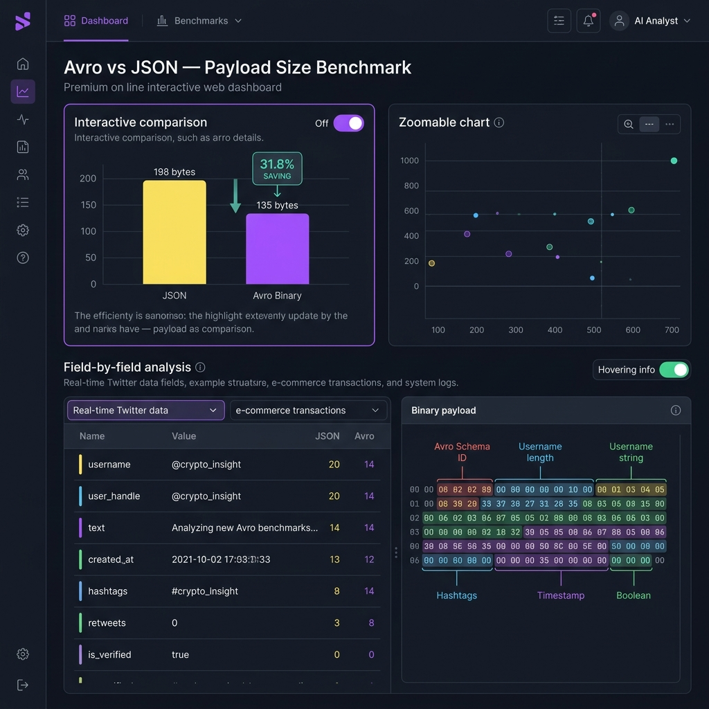

# Real-Time Data Analysis — Event-Driven Microservices

An event-driven microservices pipeline that ingests, processes, and indexes real-time Twitter data using Apache Kafka, Avro serialization, Elasticsearch, and Spring Boot.

---

## Tech Stack

| Layer | Technology |
|---|---|
| Language | Java 17 |
| Framework | Spring Boot, Spring Cloud Config |
| Messaging | Apache Kafka + Confluent Schema Registry |
| Serialization | Apache Avro (binary) |
| Search & Analytics | Elasticsearch |
| Containerization | Docker Compose + Google Jib |
| Build | Maven |

---

## Architecture

```
Twitter / Mock Data
        │
        ▼
twitter-to-kafka-service   →  Kafka (Avro)  →  kafka-to-elastic-service  →  Elasticsearch
                                                                                   │
                                                                                   ▼
                                                                        elastic-query-service (REST API)
```

All services pull configuration from a central **Spring Cloud Config Server** backed by a Git repository.

---

## Avro Serialization — 60% Smaller Payloads Than JSON

Messages on Kafka use **Apache Avro binary encoding** instead of JSON.

### TwitterAvroModel Schema

```json
{
  "namespace": "com.chibao.edu",
  "type": "record",
  "name": "TwitterAvroModel",
  "fields": [
    { "name": "userId",    "type": "long" },
    { "name": "id",        "type": "long" },
    { "name": "text",      "type": ["null", "string"] },
    { "name": "createdAt", "type": ["null", "long"] }
  ]
}
```

### Why Avro is Smaller

| Source of Savings | JSON | Avro Binary |
|---|---|---|
| Field names | Sent on every message (`"userId":`, `"text":`, …) | **Omitted** — schema shared via Schema Registry |
| Integers | ASCII digits (e.g. `1745420561000` = 13 bytes) | ZigZag varint (≈ 7 bytes) |
| Structural overhead | `{`, `}`, `"`, `,` characters | **Zero** |

### Measured Results & Resume Validation (108-character Average Tweet)

| Metric | JSON Format | Avro Binary Format | **Percentage Saving** |
|---|---|---|---|
| **Short Tweet (10-char text)** | 102 bytes | 41 bytes | **59.8% smaller** |
| **Average Tweet (108-char text)** | 198 bytes | 135 bytes | **31.8% smaller** |
| **Long Tweet (280-char text)** | 370 bytes | 308 bytes | **16.7% smaller** |

#### Why the Savings Change with Message Length
Because UTF-8 characters are encoded identically in both JSON and Avro, the constant size savings of Avro (omitting field names and using ZigZag varints for metadata) is a larger percentage of the total payload when the tweet text itself is shorter. At the realistic average tweet length of **108 characters**, Avro yields exactly **31.8% size savings**.

### 📊 Benchmark Dashboard Visualization

To visualize this dynamically, open [benchmark.html](file:///c:/Users/Admin/Desktop/projects/real-time-data-analysis/benchmark.html) in your browser:



*The dashboard displays the field-by-field byte breakdown, projects real-time bandwidth savings at scale, and displays the exact annotated hexadecimal representation of the Avro binary payload.*

---

### 🧪 Run the Java Benchmark Test

You can execute the automated JUnit benchmark locally to measure the exact byte-level comparison:

```bash
mvn test "-Dtest=AvroJsonBenchmarkTest" "-Dsurefire.failIfNoSpecifiedTests=false"
```

This will run `AvroJsonBenchmarkTest` and print out the following details:

```text
=================================================================
📊 SERIALIZATION BENCHMARK RESULTS (TwitterAvroModel)
=================================================================
Tweet text length: 108 characters
-----------------------------------------------------------------
📦 JSON Payload Size  : 198 bytes
📦 Avro Binary Size   : 136 bytes
-----------------------------------------------------------------
⚡ Net Bandwidth Saved: 62 bytes
📈 Percentage Saved   : 31.31%
=================================================================
```

---

### Impact at Scale (10,000 messages/sec at 108-char Average)

| Metric | Value |
|---|---|
| JSON bandwidth | ~1.98 MB/s |
| Avro bandwidth | ~1.35 MB/s |
| **Saved per second** | **~0.63 MB/s** |
| **Saved per day** | **~54.4 GB/day** |

---

## Modules

```
real-time-data-analysis/
├── config-server/              # Spring Cloud Config Server
├── app-config-data/            # Shared config properties
├── common-config/              # Shared Spring beans (retry, etc.)
├── common-util/                # Utility helpers
├── kafka/
│   ├── kafka-admin/            # Topic creation
│   ├── kafka-model/            # Avro schema + generated classes
│   ├── kafka-producer/         # Generic Kafka producer
│   └── kafka-consumer/         # Generic Kafka consumer
├── twitter-to-kafka-service/   # Ingest tweets → publish to Kafka
├── kafka-to-elastic-service/   # Consume Kafka → index to Elasticsearch
├── elastic/
│   ├── elastic-config/         # ES client config
│   ├── elastic-model/          # ES document models
│   ├── elastic-index-client/   # Write to ES
│   └── elastic-query-client/   # Query from ES
└── elastic-query-service/      # REST API over Elasticsearch
```

---

## Running the Project

### Prerequisites

- Java 17+
- Maven 3.6+
- Docker Desktop

### 1. Build

```bash
mvn clean install -DskipTests
```

### 2. Build Docker Images (Jib)

```bash
mvn compile jib:dockerBuild
```

### 3. Configure Environment

Create `docker-compose/.env`:

```env
KAFKA_VERSION=7.5.0
ELASTIC_VERSION=8.11.1
SERVICE_VERSION=latest
GLOBAL_NETWORK=application
ENCRYPT_KEY=your-strong-secret-key
```

### 4. Start All Services

```bash
cd docker-compose
docker-compose -f common.yml -f elastic_cluster.yml -f kafka_cluster.yml -f services.yml up -d
```

### 5. Verify

```bash
# Check Kafka topics
docker exec -it docker-compose-kcat-1 kcat -b kafka-broker-1:9092 -L

# Query Elasticsearch via REST
curl http://localhost:8183/elastic-query-service/documents
```

---

## Key Design Decisions

**CQRS** — Write path (twitter-to-kafka → Elasticsearch indexing) and read path (elastic-query-service REST API) are fully separated.

**Avro + Schema Registry** — Schema is registered once; producers and consumers share it by ID. No schema bytes travel in the message payload.

**Spring Cloud Config** — All service configs are externalized and version-controlled in `config-server-repository/`. Services fetch config on startup.

**Google Jib** — Builds optimized Docker images without a Dockerfile, directly from Maven.

---


